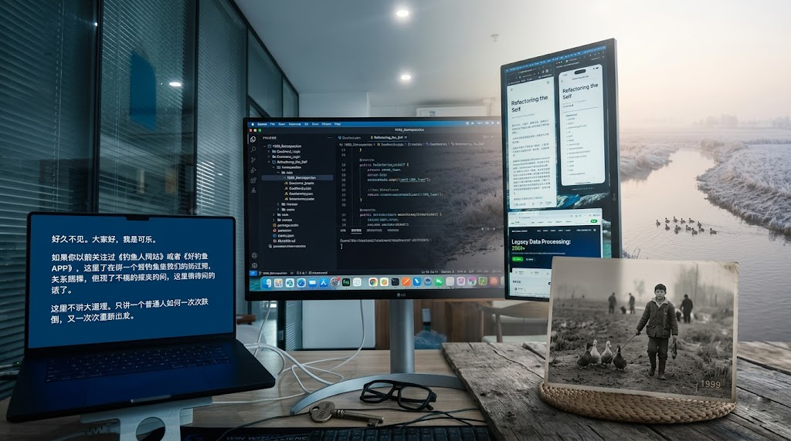

# Life is a legacy system that requires constant refactoring.

## 底层重构

> 人生和软件系统其实很像。
> 都会积累技术债，都会经历失控，也都需要不断重构。

👉 [关于作者](./ABOUT.md)

### 连载目录

👉 [阅读 第01章：《我被三百块钱赶出了学校》](./chapters/01-kicked-out-for-300.md)

👉 [阅读 第02章：《实验班名单上，没有我的名字》](./chapters/02-experimental-class-list.md)

👉 [阅读 第03章：《四百只鸭子与田埂上的歌》](./chapters/03-four-hundred-ducks.md)

👉 [阅读 第04章：《四星村的鳝鱼》](./chapters/04-sixing-village-eels.md)

👉 [阅读 第05章：《爷爷的鸭棚》](./chapters/05-grandpas-duck-shed.md)

👉 [阅读 第06章：《千禧年，第一次进城的少年》（预告）](./chapters/06-millennium-first-trip-to-city.md)

### 为什么写《底层重构》

人生和软件系统其实很像。都会积累技术债，都会经历失控，也都需要不断重构。

把这些经历写下来，既是对自己的交代，也是想把那些走过的弯路、吃过的苦、重新站起来的过程，留给后来的人看一看。

---

**Still building.**
**Still learning.**
**Still refactoring.**
